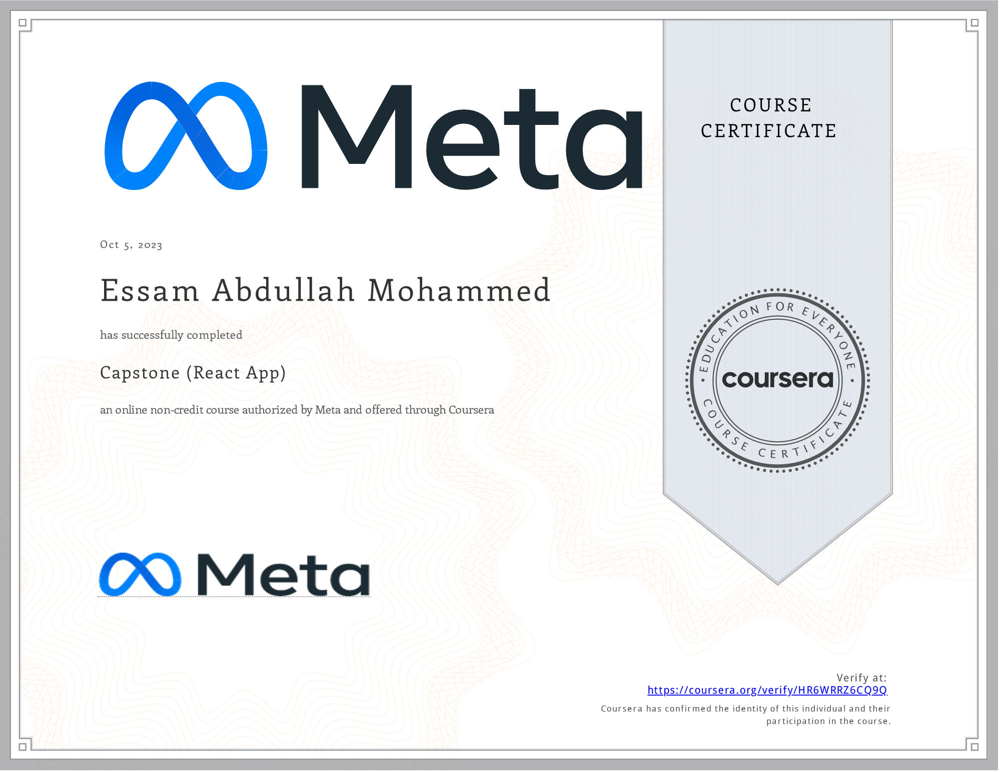

# Capstone (React App)

- This directory contains all of my assignments from the Coursera Course: [Capstone (React App)](https://www.coursera.org/learn/capstone-react-app)

## Table of Content

  - Week 1: [Starting the Project](https://github.com/x39OME/Meta-React-Native-Specialization/tree/main/8%20-%20Capstone%20(React%20App)/Week%201)
  - Week 2: [Project Functionality](https://github.com/x39OME/Meta-React-Native-Specialization/tree/main/8%20-%20Capstone%20(React%20App)/Week%202)
  - Week 3: [Project Assessment](https://github.com/x39OME/Meta-React-Native-Specialization/tree/main/8%20-%20Capstone%20(React%20App)/Week%203)

## Proof of Completion

<a href="https://www.coursera.org/account/accomplishments/certificate/HR6WRRZ6CQ9Q"> Verified Coursera Certifies</a>

