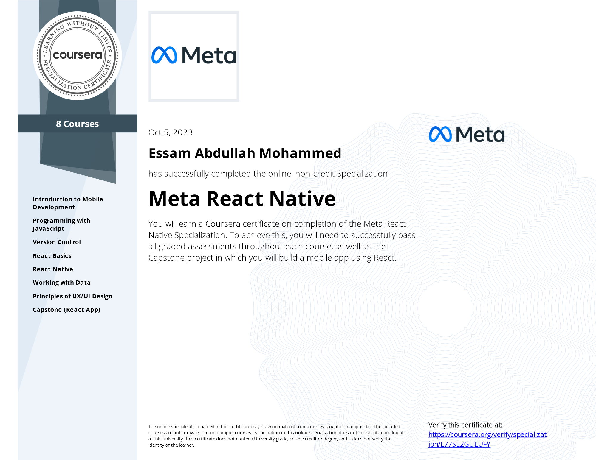

# Meta React Native Specialization

- This repo contains all of 8 courses in the Coursera Professional Certificate: [Meta React Native Specialization](https://www.coursera.org/specializations/meta-react-native)

## Table of Content

<b>Course 1: </b><a href=""><b>Introduction to Mobile Development</b></a>

  * Week 1: [Mobile Applications]()
  * Week 2: [Introduction to HTML and CSS]()
  * Week 3: [React and React Native]()
  * Week 4: [Course summary and graded assessment]()

<b>Course 2: </b><a href="https://github.com/x39OME/Meta-Front-End-Developer-Professional-Certificate/tree/main/2%20-%20Programming%20with%20JavaScript"><b>Programming with JavaScript</b></a>

  * Week 1: [Introduction to Javascript]()
  * Week 2: [The Building Blocks of a Program]()
  * Week 3: [Programming Paradigms]()
  * Week 4: [Testing]()
  * Week 5: [End-of-Course Graded Assessment]()

<b>Course 3: </b><a href="#"><b>Version Control</b></a>

  * Week 1: [Software collaboration]()
  * Week 2: [Command Line]()
  * Week 3: [Working with Git]()
  * Week 4: [Graded Assessment]()

<b>Course 4: </b><a href="#"><b>React Basics</b></a>

  * Week 1: [React Components]()
  * Week 2: [Data and State]()
  * Week 3: [Navigation, Updating and Assets in React.js]()
  * Week 4: [Your first React app]()

<b>Course 5: </b><a href=""><b>React Native</b></a>

  * Week 1: 
  * Week 2: 
  * Week 3: 
  * Week 4: 

<b>Course 6: </b><a href=""><b>Working with Data</b></a>

  * Week 1: 
  * Week 2: 
  * Week 3: 
  * Week 4: 

<b>Course 7: </b><a href=""><b>Principles of UI/UX Design</b></a>

  * Week 1: [Introduction to UX and UI design]()
  * Week 2: [Evaluating interactive design]()
  * Week 3: [Applied Design Fundamentals]()
  * Week 4: [Designing your UI]()
  * Week 5: [Course summary and final assessment]()

<b>Course 8: </b><a href=""><b>Capstone (React App)</b></a>

  * Week 1: 
  * Week 2: 
  * Week 3: 
  * Week 4: 

## Proof of Completion

- <a href=""> Verified Coursera Certifies</a>

